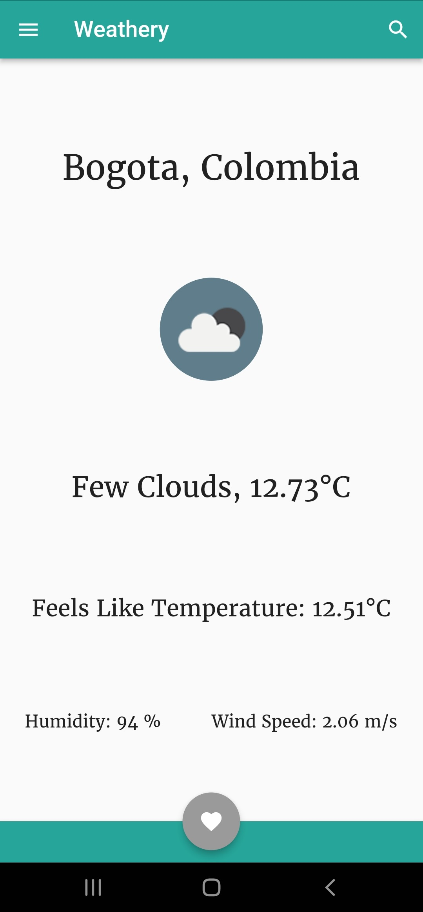
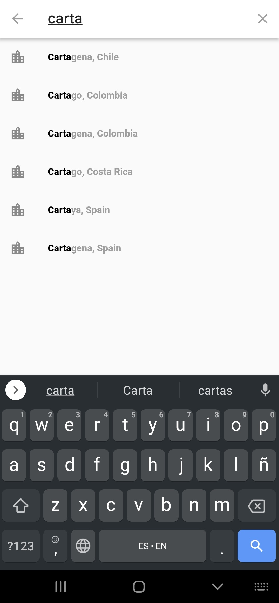
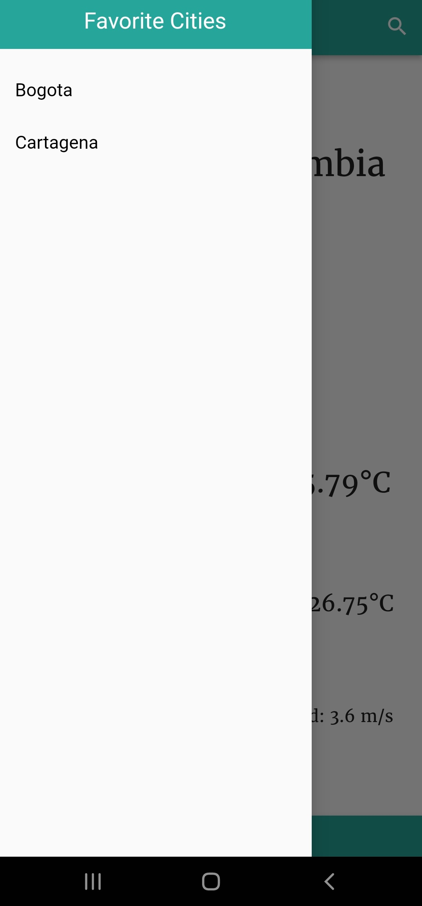

# WeatheryApp

A minimalistic weather app, using Flutter.
Written as a project for my mobile development class.

It allows allows the user to check for the weather, temperature and other information returned by OpenWeather api.

It can perform searches of most cities: 

And then store those searches as favorites for future reference:

